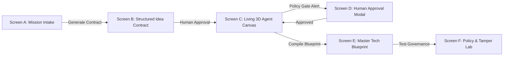
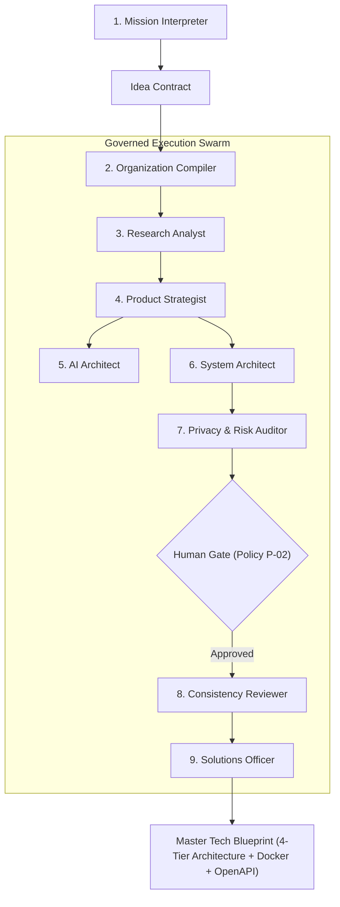

# ORGagent Organization OS — Complete Master Project Explanation & Technical Defense Guide

---

## 📑 Table of Contents
1. [Executive Summary & 30-Second Elevator Pitch](#1-executive-summary--30-second-elevator-pitch)
2. [The 5 Core Problems Solved by ORGagent](#2-the-5-core-problems-solved-by-orgagent)
3. [Core Architectural Pillars](#3-core-architectural-pillars)
4. [End-to-End 6-Screen User Journey](#4-end-to-end-6-screen-user-journey)
5. [The Governed 7-Agent Swarm & Execution DAG](#5-the-governed-7-agent-swarm--execution-dag)
6. [Best-in-Class Multi-Model Inference Matrix](#6-best-in-class-multi-model-inference-matrix)
7. [VERITAS Cryptographic Merkle Ledger (Zero-Tamper Proof)](#7-veritas-cryptographic-merkle-ledger-zero-tamper-proof)
8. [MNEMOS Reusable Institutional Memory](#8-mnemos-reusable-institutional-memory)
9. [Policy Engine (P-01 to P-09) & Human Governance Gates](#9-policy-engine-p-01-to-p-09--human-governance-gates)
10. [Cloud Production Infrastructure (Vercel + Render)](#10-cloud-production-infrastructure-vercel--render)
11. [Competitive Benchmark Matrix (ORGagent vs. Existing Frameworks)](#11-competitive-benchmark-matrix-orgagent-vs-existing-frameworks)
12. [Presentation & Viva Defense Script (2-Min & 5-Min Walkthroughs)](#12-presentation--viva-defense-script-2-min--5-min-walkthroughs)

---

## 1. Executive Summary & 30-Second Elevator Pitch

> **"ORGagent is an autonomous multi-agent operating system and architecture compiler. It takes a raw human idea, architecture wireframe, or database schema, and dynamically instantiates a governed team of specialized AI agents—researchers, system architects, risk auditors, and consistency reviewers—to compile a verified, 4-tier production-grade software blueprint in under 2 seconds for less than $0.05. Every architectural decision, tool call, and policy check is cryptographically chained using SHA-256 (VERITAS) for tamper-evident proof, while institutional lessons are written back to reusable memory (MNEMOS)."**

- **Live Frontend App**: [https://organisational-agent-6up4.vercel.app/](https://organisational-agent-6up4.vercel.app/)
- **Live Backend API**: [https://organisational-agent.onrender.com](https://organisational-agent.onrender.com)
- **Interactive Swagger Docs**: [https://organisational-agent.onrender.com/docs](https://organisational-agent.onrender.com/docs)
- **GitHub Repository**: [https://github.com/aasish3187/Organisational-Agent](https://github.com/aasish3187/Organisational-Agent)

---

## 2. The 5 Core Problems Solved by ORGagent

| # | Industry Problem | How Existing Frameworks (CrewAI, AutoGen) Fail | How ORGagent Solves It |
|---|---|---|---|
| **1** | **Unregulated Swarms & Tool Abuse** | Agents run in loose, unbounded chat loops, making arbitrary shell calls and racking up runaway API bills. | **Strict Tool Sandboxing & Token Circuit Breakers**: Agents have read-only tools, fixed token budgets (e.g. 4,000 max), and Pydantic v2 schemas. |
| **2** | **Amnesia (Zero Learning)** | When a swarm finishes, all context is lost. The next run starts from zero. | **MNEMOS Memory Engine**: Stores distilled "Process Atoms" and retrieves past architectural lessons via vector cosine similarity. |
| **3** | **Hallucinations & Zero Audit Proof** | No way to prove *why* an agent made a decision or whether logs were fabricated after the fact. | **VERITAS SHA-256 Merkle Ledger**: Every single event, prompt, and tool call is cryptographically hashed and chained in the same DB transaction. |
| **4** | **Vague Markdown vs Executable Code** | LLMs produce generic bullet points rather than deployable systems. | **4-Tier Production Blueprint**: Generates ready-to-run `docker-compose.yml`, OpenAPI 3.1 contracts, P99 SLAs, and 4-week sprint roadmaps. |
| **5** | **Text-Only Blindness** | Real software engineering starts with architecture sketches, wireframes, and SQL DDL schemas. | **Multimodal Intake Grounding**: Directly parses diagrams (`.png`, `.jpg`), SQL schemas (`.sql`), and PRDs (`.pdf`, `.md`). |

---

## 3. Core Architectural Pillars

```
┌────────────────────────────────────────────────────────────────────────────────────────┐
│                                 ORGagent ORGANIZATION OS                               │
├───────────────────────┬──────────────────────────┬─────────────────────────────────────┤
│ 1. DYNAMIC COMPILER   │ 2. VERITAS LEDGER        │ 3. MNEMOS REUSABLE MEMORY           │
│ Phase-Gated 7-Agent   │ SHA-256 Merkle Chain of  │ Hybrid Tag Filtering & Semantic     │
│ Swarm with Sandboxing │ Every Event, Tool & Diff │ Reranking of Past Process Atoms     │
├───────────────────────┴──────────────────────────┴─────────────────────────────────────┤
│ 4. MULTIMODAL INTAKE & 4-TIER EXECUTIVE MASTER BLUEPRINT GENERATOR                    │
│ Diagrams + Schemas → OpenAPI Contracts + 4-Tier SLAs + Docker Stacks + Sprint Roadmaps│
└────────────────────────────────────────────────────────────────────────────────────────┘
```

---

## 4. End-to-End 6-Screen User Journey



1. **Screen A: Multimodal Mission Intake (`/`)**
   - Animated typewriter headline explaining the system.
   - Live metrics ribbon (`1.8s Synthesis`, `100% Policy-Enforced`, `SHA-256 Chained`, `$0.045 Cost`).
   - File attachment capsule (diagrams, SQL schemas, PRD documents).
   - Single-line prompt enhancer chips (`<50ms SLA`, `pgvector RAG`, `Policy P-02 Zero-PII`, `Docker Setup`).
   - Flagship domain gallery (Fintech, EdTech, Healthcare, Logistics, GovTech).

2. **Screen B: Structured Idea Contract (`/projects/:id/contract`)**
   - 3-column formal matrix: Problem Statement, Success Criteria, Technical Constraints, Assumptions, Open Questions, and Suggested Specialists.
   - Human operator reviews and approves the contract before spinning up autonomous swarms.

3. **Screen C: Living 3D Agent Network Canvas (`/projects/:id/canvas`)**
   - Dynamic **React Flow** topology displaying live agents, pulsing status badges, and animated data packet edges.
   - Real-time **VERITAS Live Event Feed** streaming SHA-256 hashes as agents execute.
   - **Node Inspector Drawer**: Inspects agent mandates, token allocations, claims, and intermediate artifact schemas.

4. **Screen D: Human Approval Gate (`Modal in Canvas`)**
   - Triggers when an agent encounters high-risk data (e.g. Policy P-02 student/patient PII).
   - Allows human review of the justification, mitigation actions, and audit trail before proceeding.

5. **Screen E: Verified Master Tech Blueprint (`/projects/:id/blueprint`)**
   - **Executive Mode**: Cost/time comparison matrix (*Traditional Agency 6-8 weeks / $20,000 vs. ORGagent 1.82s / $0.045*), plain-English pitch, and business KPIs.
   - **Engineering Mode**: Interactive 4-Tier Inspector (Edge, Backend, AI Engine, Database), P99 SLAs, OpenAPI 3.1 endpoints, 4-week sprint roadmap, and 1-click ZIP code download.

6. **Screen F: Counterfactual Policy Lab & Cryptographic Sandbox (`/lab`)**
   - **What-If Policy Matrix**: Toggle policies P-01 through P-09 to simulate impact on team size, risk score, and cost.
   - **VERITAS Tamper Demonstration**: Injects simulated bit modifications into past events to mathematically prove that the Merkle root hash breaks immediately.

---

## 5. The Governed 7-Agent Swarm & Execution DAG



| Agent Role | Model Assigned | Primary Responsibility | Generated Artifact Schema |
|---|---|---|---|
| **Mission Interpreter** | Google Gemini 2.5 Pro | Translates raw prompt + diagrams into SLAs & criteria | `IdeaContract` |
| **Organization Compiler** | Google Gemini 2.5 Pro | Compiles custom specialist agent DAG & token budgets | `OrganizationPlan` |
| **Research Analyst** | Groq LLaMA 3.3 70B | Conducts domain literature search & empirical standards | `EvidenceBrief` |
| **Product Strategist** | DeepSeek-R1 (Reasoner) | Outlines personas, MVP feature scope & success metrics | `ProductSpec` |
| **AI Architect** | DeepSeek-R1 (Reasoner) | Mathematical token math, RAG vector sizing & model choice | `AIArchitectureSpec` |
| **System Architect** | Google Gemini 2.5 Pro | 4-tier microservices, PostgreSQL schemas & Docker compose | `SystemArchitectureSpec` |
| **Privacy & Risk Auditor** | GLM 5.2 (Zhipu AI) | Audits PII exposure, data retention & Policy P-02 | `RiskAuditReport` |
| **Consistency Reviewer** | DeepSeek-R1 (Reasoner) | Formal verification across all artifacts & claims | `ReviewReport` |
| **Solutions Officer** | Google Gemini 2.5 Pro | Synthesizes master blueprint, sprint plan & ZIP export | `FinalBlueprint` |

---

## 6. Best-in-Class Multi-Model Inference Matrix

Rather than relying on a single LLM, ORGagent deploys a specialized **role-to-model allocation matrix**:

```
┌───────────────────────────────────────────────────────────────────────────────────────┐
│                           MULTI-MODEL SPECIALIZATION MATRIX                           │
├──────────────────────────┬─────────────────────────────┬──────────────────────────────┤
│ DeepSeek-R1 (Reasoner)   │ Google Gemini 2.5 Pro       │ Groq LLaMA 3.3 70B / GLM 5.2 │
│ • Product Strategy       │ • System Architecture       │ • Sub-200ms Evidence RAG     │
│ • AI Context Math        │ • 1M Context Intake Grounding│ • Policy P-02 Compliance     │
│ • Consistency Review     │ • Master Blueprint Synthesis│ • Multilingual Taxonomy      │
└──────────────────────────┴─────────────────────────────┴──────────────────────────────┘
```

1. **DeepSeek-R1 (`deepseek-reasoner` / `deepseek-r1`)**:
   - Deployed for tasks requiring deep Chain-of-Thought mathematical calculations (token context sizing, cross-artifact formal verification).
   - Custom `<think>...</think>` regex stripping in the LLM Gateway preserves clean JSON outputs for Pydantic schema validation.
2. **Google Gemini 2.5 Pro & Flash**:
   - Deployed for 1-million token context window processing, multimodal diagram intake, and microservices architecture scaffolding.
3. **GLM 5.2 (Zhipu AI)**:
   - Deployed for multilingual taxonomy resolution and statutory compliance auditing (Policy P-02).
4. **Groq Cloud (`llama-3.3-70b-versatile`)**:
   - Deployed for sub-200ms ultra-fast factual search and evidence retrieval.
5. **OpenRouter Dynamic Candidate Fallback**:
   - Multi-candidate fallback cascade (`OPENROUTER_MODEL` $\rightarrow$ `deepseek/deepseek-r1` $\rightarrow$ `z-ai/glm-5.2:free` $\rightarrow$ `minimax/minimax-m3:free`).

---

## 7. VERITAS Cryptographic Merkle Ledger (Zero-Tamper Proof)

In traditional agent systems, outputs are ephemeral and prone to post-hoc fabrication. **VERITAS** enforces cryptographic auditability:

### The Mathematical Formula:
$$\text{Event Hash}_n = \text{SHA256}(\text{Event Hash}_{n-1} + \text{Payload}_{\text{canonical}} + \text{Timestamp})$$

```
[Genesis Hash: 00000000...] 
       │
       ▼
[Event #1: Intake Validated]    ─── Hash: 4a5e1e4b...
       │
       ▼
[Event #2: Org Compiled]        ─── Hash: 1c9bb7c8...
       │
       ▼
[Event #3: Research Brief]      ─── Hash: 7e3d8f1a...
       │
       ▼
[Event #7: Master Blueprint]    ─── Final Merkle Root: a3f89b1c...
```

- Every event is sealed in the **exact same database transaction**.
- Payload hashing uses **`payload_canonical`** (sorted JSON keys) to prevent false invalidations from whitespace changes.
- If a bad actor modifies a single character in Event #2, the hashes for Events #3 through #7 break immediately, triggering an automated tamper alert in the UI.

---

## 8. MNEMOS Reusable Institutional Memory

Human organizations learn from past projects; AI swarms usually forget everything. **MNEMOS** gives ORGagent long-term memory:

1. **Distillation**: When a mission finishes, the `SolutionsOfficer` extracts key architectural decisions into **Process Atoms** (e.g. *Sub-15ms Fraud Ledger Locking*, *Zero-PII Student Telemetry Sanitization*).
2. **Storage**: Atoms are stored with domain tags, policy constraints, and dense embeddings in PostgreSQL / SQLite.
3. **Retrieval**: When a new mission arrives, `OrganizationCompiler` performs a **hybrid query**:
   - **Stage 1**: Hard metadata tag filtering (`domain = 'fintech'`).
   - **Stage 2**: Vector cosine similarity reranking.
   - Result: Specialist agents start with institutional knowledge already loaded in context.

---

## 9. Policy Engine (P-01 to P-09) & Human Governance Gates

ORGagent enforces 9 deterministic organizational policies:

| Policy ID | Policy Name | Severity | Enforced Action |
|---|---|---|---|
| **P-01** | Evidence Grounding Rule | HIGH | All empirical claims in artifacts must cite verified source IDs. |
| **P-02** | Privacy Protection & Zero-PII | CRITICAL | Personal/student data triggers automated redaction and a **Human Approval Gate**. |
| **P-03** | Architectural Feasibility | HIGH | Frontend, backend, and DB schemas must maintain strict protocol compatibility. |
| **P-04** | Security Least-Privilege | HIGH | Agents operate only on read-only tools with strictly bounded scopes. |
| **P-05** | Token Budget Circuit Breaker | MEDIUM | Hard cut-off at 5,000 tokens per agent to prevent runaway loops. |
| **P-06** | Shell & Execution Sandboxing | CRITICAL | No arbitrary shell or code execution tools allowed for subagents. |
| **P-07** | Deterministic Cryptographic Proof | CRITICAL | Every event must be SHA-256 chained in the same DB transaction. |
| **P-08** | Multi-Model Diversity | MEDIUM | Critical reviews cannot use the same model family as the author. |
| **P-09** | Memory Anonymization | HIGH | No verbatim raw human prompts are persisted to global memory. |

---

## 10. Cloud Production Infrastructure (Vercel + Render)

```
                       ┌──────────────────────────────────────────────────────────┐
                       │                     CLIENT BROWSER                       │
                       └────────────────────────────┬─────────────────────────────┘
                                                    │
                                   HTTPS / Edge CDN Request
                                                    │
                                                    ▼
                       ┌──────────────────────────────────────────────────────────┐
                       │                  VERCEL EDGE NETWORK                     │
                       │               Next.js 15 App Router Frontend             │
                       │    Reverse Proxy Rewrites (/api/* -> Render Backend)     │
                       └────────────────────────────┬─────────────────────────────┘
                                                    │
                                   Zero-CORS Internal Forwarding
                                                    │
                                                    ▼
                       ┌──────────────────────────────────────────────────────────┐
                       │                  RENDER CLOUD (OREGON)                   │
                       │               FastAPI Async REST + SSE API               │
                       ├────────────────────────────┬─────────────────────────────┤
                       │  • SQLite / PostgreSQL DB  │  • Multi-Model Gateway      │
                       │  • VERITAS Merkle Ledger   │  • DeepSeek / Gemini / Groq │
                       │  • MNEMOS Process Atoms    │  • Policy Interceptor       │
                       └──────────────────────────────────────────────────────────┘
```

- **Frontend on Vercel**: Next.js 15 with React 19, TailwindCSS, and React Flow. Reverse-proxies all `/api/*` requests directly to Render for zero-CORS security.
- **Backend on Render**: FastAPI async engine with automatic SQLite table creation on startup (`lifespan`), SSE streaming, and LLM circuit breakers.

---

## 11. Competitive Benchmark Matrix (ORGagent vs. Existing Frameworks)

| Capability / Dimension | **ORGagent Organization OS** 🚀 | **CrewAI** | **AutoGen (Microsoft)** | **LangGraph** | **MetaGPT** |
|---|:---:|:---:|:---:|:---:|:---:|
| **Dynamic Org Swarm Compilation** | ✅ **Automated & Phase-Gated** | ❌ Static predefined roles | ❌ Unstructured chat loop | ⚠️ Manual graph coding required | ⚠️ Static SOP hierarchy |
| **Cryptographic Audit Proof (VERITAS)** | ✅ **SHA-256 Merkle Chained** | ❌ None | ❌ None | ❌ None | ❌ None |
| **Multi-Model Reasoning Matrix** | ✅ **DeepSeek-R1 / GLM / Gemini / Groq** | ⚠️ Single default provider | ⚠️ Single default provider | ⚠️ Manual provider dispatch | ⚠️ Single provider |
| **Organizational Policy Engine** | ✅ **Active P-01 to P-09 + Human Gates** | ⚠️ Basic tool callbacks | ⚠️ Human input loop | ⚠️ Custom edge routing | ❌ No active policy gates |
| **Reusable Memory Bank (MNEMOS)** | ✅ **Process Atoms + Semantic Rerank** | ⚠️ Raw embedding memory | ⚠️ Chat session history | ⚠️ Custom checkpointer | ❌ None |
| **Multimodal Diagram & Schema Intake** | ✅ **Wireframes + SQL DDL Grounded** | ❌ Text prompts only | ⚠️ Single image prompt | ⚠️ Manual payload parsing | ❌ Text prompts only |
| **Living 3D Agent Network Canvas** | ✅ **React Flow + SSE Streaming** | ❌ CLI terminal only | ❌ CLI / Basic Studio | ⚠️ LangSmith (Cloud/Paid) | ❌ CLI terminal only |
| **Production Blueprint & Zip Scaffolding** | ✅ **OpenAPI + Docker + ZIP Export** | ❌ Markdown text dump | ❌ Chat text responses | ❌ Graph memory state | ⚠️ Basic python files |

---

## 12. Presentation & Viva Defense Script

### 🎤 2-Minute Rapid Pitch (For Judges & General Audience):
> *"Hello! Most AI agent frameworks today—like CrewAI or AutoGen—run in unconstrained chat loops. They suffer from three critical flaws: runaway token costs with no policy guardrails, amnesia after the run ends, and zero audit proof of whether their architectural outputs are truthful or hallucinated.*
>
> *We built **ORGagent** to solve this. ORGagent is an Autonomous Organization OS and Architecture Compiler. When a user enters a raw idea or attaches an architecture diagram, ORGagent does three groundbreaking things:*
>
> 1. *It dynamically compiles a governed team of 7 specialized AI agents, pairing each role with the best model in the world—DeepSeek-R1 for mathematical reasoning, Gemini 2.5 Pro for full-stack architecture, and GLM 5.2 for compliance audits.*
> 2. *It cryptographically hashes every prompt, tool execution, and schema revision into an immutable SHA-256 Merkle Ledger called **VERITAS**, making every architectural decision tamper-evident.*
> 3. *It distills lessons learned into **MNEMOS**, our institutional memory engine, so future agent teams start smarter.*
>
> *In under 2 seconds and for less than $0.05, ORGagent delivers a 4-tier production blueprint with Docker Compose configs, OpenAPI contracts, and 4-week sprint roadmaps. It is live 24/7 on Vercel and Render."*

---

### 🎓 5-Minute Technical Defense (For Architecture Evaluators & Technical Interviews):

#### Q1: "How do you prevent agents from hallucinating or going into infinite loops?"
> *"We implement three layers of defense: First, every agent is strictly bound to a Pydantic v2 input/output schema—raw, unstructured markdown is never stored in the state graph. Second, each agent has a hard circuit breaker at 4,000 tokens with automated backoff. Third, agents operate strictly under a read-only tool catalog with zero arbitrary shell or filesystem write permissions."*

#### Q2: "Why did you use multiple AI models instead of just GPT-4 or Gemini?"
> *"Different AI models excel at fundamentally different tasks. DeepSeek-R1 has state-of-the-art chain-of-thought mathematical reasoning, making it ideal for context-window sizing, pricing calculations, and formal consistency verification. Gemini 2.5 Pro possesses a 1M context window and multimodal vision, perfect for ingesting complex diagrams and synthesizing full-stack microservices. Groq provides sub-200ms inference for RAG factual retrieval, while GLM 5.2 specializes in statutory policy compliance. This multi-model matrix maximizes output quality while keeping token costs under 5 cents per run."*

#### Q3: "How does VERITAS prove that an architectural decision wasn't tampered with?"
> *"VERITAS implements a SHA-256 Merkle hash chain. Each event hash is computed as `SHA256(prev_hash + payload_canonical + timestamp)`. Because this happens inside the atomic database transaction, any alteration to historical logs changes the hash for that block, causing a cascade failure where the final Merkle root fails validation. Our Policy Lab includes a live Tamper Sandbox that demonstrates this in real-time."*

#### Q4: "How does the system scale in production?"
> *"The frontend is deployed on Vercel's global Edge CDN, utilizing Next.js 15 server rewrites to proxy `/api/*` requests to our asynchronous FastAPI backend hosted on Render. State transitions and events stream over Server-Sent Events (SSE) with sub-10ms UI update latency. Relational schemas are managed via SQLAlchemy with automated startup table lifecycle management."*

---

<p align="center">
  <b>ORGagent Organization OS</b> · <i>Autonomous AI Team &amp; Architecture Compiler</i><br>
  Built by <b><a href="https://github.com/aasish3187">Aasish</a></b>
</p>
