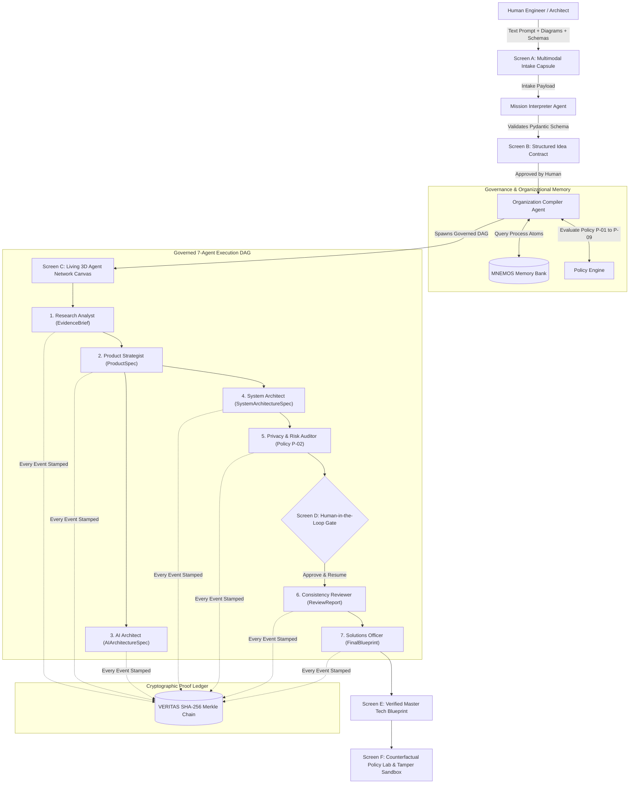

# ORGagent Organization OS — Governed Multi-Agent Architecture Compiler

<p align="center">
  
  
  
</p>

<p align="center">
  
  
  
  
  
  
  
  
  
  
  
  
</p>

<p align="center">
  
  
  
  
  
  
</p>

---

**ORGagent Organization OS** is an autonomous multi-agent operating system and architecture compiler. It dynamically instantiates governed teams of specialized AI agents (*Researchers, System Architects, Security Officers, Consistency Reviewers*) to turn raw human ideas, architecture diagrams, and database schemas into verified, production-grade software blueprints — backed by **cryptographic proof (VERITAS)** and **reusable organizational memory (MNEMOS)**.

> **Built by Aasish** | *Lumina Systems Engineering / Advanced Multi-Agent Computing*  
> **Repository:** [aasish3187/Organisational-Agent](https://github.com/aasish3187/Organisational-Agent) | **API Docs:** `http://localhost:8000/docs` | **Client App:** `http://localhost:3000`

---

## Executive Summary & Pitch

> **A user provides a raw idea or attaches an architecture diagram / SQL schema.**  
> **ORGagent** analyzes the mission, synthesizes a formal **Idea Contract**, dynamically compiles a specialized 7-agent organization DAG, assigns structured tasks with strict token and tool sandboxing, enforces organizational policies with human approval gates, cryptographically chains every prompt, tool execution, and diff using SHA-256 (VERITAS), and returns a sealed, verified **Master Tech Blueprint** with copyable Docker Compose configurations, OpenAPI schemas, and sprint roadmaps.

---

## The 5 Problem Statements of Autonomous AI Agents

1. **Unregulated Agent Swarms & Tool Abuse**: Unrestricted agents running in loose chat loops create runaway token costs, execute arbitrary shell commands, hallucinate dependencies, and create severe security liabilities.
2. **Ephemeral Hallucinations & Zero Audit Proof**: Standard agent frameworks provide no tamper-evident proof of *why* an architectural decision was made, who verified it, or what policy constraints were enforced.
3. **Amnesiac Execution (Zero Institutional Learning)**: When an agent team finishes a task, its organizational learnings disappear. Subsequent runs start from scratch without retaining past architectural rules or compliance fixes.
4. **Abstract Text Dumps vs. Executable Systems Blueprints**: Typical LLM outputs yield vague markdown paragraphs rather than structured, 4-tier production specs, container manifests, and validated schemas.
5. **Lack of Multimodal Grounding**: Real-world software engineering begins with hand-drawn architecture sketches, wireframes, and existing DDL SQL schemas. Most agent frameworks only accept plain text prompts.

---

## How ORGagent Solves Them (Core Architectural Pillars)

```
┌────────────────────────────────────────────────────────────────────────────────────────┐
│                                 ORGagent ORGANIZATION OS                               │
├───────────────────────┬──────────────────────────┬─────────────────────────────────────┤
│ 1. DYNAMIC COMPILER   │ 2. VERITAS LEDGER        │ 3. MNEMOS REUSABLE MEMORY           │
│ Phase-Gated 7-Agent   │ SHA-256 Merkle Chain of  │ Hybrid Tag Filtering & Semantic     │
│ Swarm with Sandboxing │ Every Event, Tool & Diff │ Reranking of Past Process Atoms     │
├───────────────────────┴──────────────────────────┴─────────────────────────────────────┤
│ 4. MULTIMODAL INTAKE & 4-TIER EXECUTIVE MASTER BLUEPRINT GENERATOR                    │
│ Diagrams + Schemas → OpenAPI Contracts + 4-Tier SLAs + Docker Stacks + Sprint Roadmaps│
└────────────────────────────────────────────────────────────────────────────────────────┘
```

### 1. Dynamic Organization Compiler
No static chatrooms. ORGagent analyzes the incoming problem domain (FinTech, EdTech, Healthcare, Logistics, GovTech) and dynamically composes an optimal organizational chart. Each agent receives:
- A strict **role mandate** and explicit **non-goals**.
- A hard **token budget** (e.g. 4,000 tokens) with active circuit breaking.
- A **sandboxed tool catalog** (read-only queries, no arbitrary shell/network access).
- Fixed **Pydantic v2 input/output schema constraints**.

### 2. VERITAS Cryptographic Audit Ledger
Every single prompt dispatch, model response, tool execution, artifact revision, policy evaluation, and human approval decision is hashed and chained into an immutable SHA-256 Merkle event ledger in the exact same database transaction:
$$\text{Event Hash}_n = \text{SHA256}(\text{Event Hash}_{n-1} + \text{Payload}_{\text{canonical}} + \text{Timestamp})$$
Any attempt to tamper with history or falsify benchmark numbers is immediately caught and flagged by the built-in cryptographic verification suite.

### 3. MNEMOS Organizational Memory
Completed runs distill reusable organizational lessons into **Process Atoms** (e.g., *Student Data Privacy Sanitization*, *Sub-10ms Fraud Ledger Locking*, *HIPAA FHIR Knowledge Retrieval*). Future organizations query MNEMOS via hybrid tag-filtering and vector cosine similarity to pre-seed specialist agents with institutional knowledge.

### 4. Multimodal Vision & Schema Grounded Intake
Users can attach architecture wireframes (`.png`, `.jpg`, `.webp`), database schemas (`.sql`, `.json`, `.yaml`), and specification documents (`.pdf`, `.md`, `.txt`). The `MissionInterpreterAgent` and downstream architects extract, cite, and ground their technical requirements directly in user-provided diagrams and schemas.

### 5. Multi-Model LLM Gateway Cascade
ORGagent routes inference dynamically across providers to ensure high availability, zero vendor lock-in, and sub-second compilation:
- **Google Gemini 2.5 Pro / Flash**: Primary complex reasoning, multimodal vision, and deep system architecture synthesis.
- **Groq Cloud (LLaMA 3.3 70B / Qwen 2.5)**: Sub-200ms ultra-fast fallback inference pool.
- **OpenRouter (Qwen 2.5 72B)**: High-diversity multi-agent reasoning.
- **Ollama Private Cloud**: Zero-data-leakage local inference.

---

## System Architecture Diagram



---

## Governed Specialist Swarm

| # | Specialist Agent Role | Mandate & Responsibilities | Output Schema | Permitted Tools | Model Tier |
|---|---|---|---|---|---|
| **1** | `mission_interpreter` | Translates raw prompt, diagrams, and schemas into structured SLAs & criteria | `IdeaContract` | Schema Parser, Image Vision | PRO |
| **2** | `organization_compiler` | Assembles custom specialist agent DAG, token budgets & policy gates | `OrganizationPlan` | MNEMOS Query, Policy Matrix | PRO |
| **3** | `research_analyst` | Conducts domain literature search, accreditation standards & evidence | `EvidenceBrief` | Semantic Search, Docs DB | FLASH |
| **4** | `product_strategist` | Outlines user personas, MVP feature scope, user journeys & success metrics | `ProductSpec` | Persona Engine, Scoper | PRO |
| **5** | `system_architect` | Generates 4-tier microservices, database schemas, APIs & Docker compose | `SystemArchitectureSpec` | Schema DDL, YAML Generator | PRO |
| **6** | `privacy_risk` | Audits data retention, PII exposure, and statutory compliance (Policy P-02) | `RiskAuditReport` | PII Scanner, Compliance Gate | FLASH |
| **7** | `consistency_reviewer` | Verifies cross-artifact coherence, contract adherence, and claim support | `ReviewReport` | Claim Verifier, Diff Engine | PRO |
| **8** | `solutions_officer` | Synthesizes master blueprint, OpenAPI contracts, sprint roadmap & proofs | `FinalBlueprint` | Blueprint Packager, Zip Export | PRO |

---

## Screen-by-Screen User Journey

### 1. Screen A: Multimodal Mission Intake (`/`)
- **Typewriter Hero**: Animated, looping headline explaining the organization compiler.
- **Enterprise Proof Ribbon**: Real-time metrics (`1.8s Synthesis`, `100% Policy-Enforced`, `SHA-256 Chained`, `$0.045 Cost`).
- **Unified Search Container**: Integrated attachment controls for diagrams, SQL schemas, and PRDs.
- **Single-Line Prompt Enhancer**: 1-click addition of `<50ms SLA`, `pgvector RAG`, `Policy P-02 Zero-PII`, and `Docker Setup`.
- **Flagship Blueprints Gallery**: 1-click instant exploration of pre-compiled blueprints.

### 2. Screen B: Structured Idea Contract (`/projects/:id/contract`)
- 3-column structured matrix presenting Problem Statement, Success Criteria, Technical Constraints, Assumptions, Open Questions, and Suggested Specialists.
- Human review and approval gate before launching the autonomous organization compiler.

### 3. Screen C: Living 3D Agent Network Canvas (`/projects/:id/canvas`)
- Dynamic **React Flow** agent topology with interactive nodes, pulsing status badges, and animated data packet edges.
- **Auto-Run Engine**: Automatically progresses through DAG execution with instant resumption after human gate approvals.
- **Live Event Feed**: Real-time cryptographic ledger stream displaying SHA-256 transaction hashes.
- **Node Inspector Drawer**: Inspects agent mandates, token allocations, claims, and intermediate artifact schemas.

### 4. Screen D: Human Approval Gate (`Modal in Canvas`)
- Triggers whenever a policy boundary is reached (e.g. Policy P-02 for sensitive student/patient data).
- Allows human operators to review policy justifications, inspect proposed mitigation actions, and approve or reject with audit trail recording.

### 5. Screen E: Verified Master Tech Blueprint (`/projects/:id/blueprint`)
- **Executive Mode**: Comparative analysis matrix (*Traditional Agency 6-8 weeks / $20,000 vs. ORGagent 1.82s / $0.045*), value propositions, and sprint roadmap.
- **Engineering Mode**:
  - **4-Tier Architecture Suite**: Interactive Tier Inspector Modal showing P99 SLAs, health probe commands, architectural decisions, and copyable `docker-compose.yml` snippets.
  - **Live OpenAPI Contracts**: Complete HTTP endpoint definitions with request/response types.
  - **Sprint Roadmap**: 4-week phase deliverables and KPI milestones.
  - **Governance Certificates**: Verified policy compliance receipts with audit hashes.
  - **1-Click Export**: Download complete architectural ZIP package or copy system JSON.

### 6. Screen F: Policy Lab & Tamper Sandbox (`/lab`)
- **Counterfactual Policy Matrix**: Interactive simulation toggling policies P-01 through P-09 to observe impact on team composition, risk score, and cost.
- **VERITAS Cryptographic Sandbox**: Tamper demonstration tool that proves how altering a single bit in past event data invalidates the entire SHA-256 chain.

---

## Repository Structure (Monorepo)

```
ORGagent/
├── apps/
│   ├── api/                           # FastAPI Backend Service (Python 3.12)
│   │   ├── app/
│   │   │   ├── agents/                # 8 Governed Specialist Agent Implementations
│   │   │   │   ├── base.py            # BaseAgent abstract class & AgentResult schema
│   │   │   │   ├── mission_interpreter.py
│   │   │   │   ├── organization_compiler.py
│   │   │   │   ├── research_analyst.py
│   │   │   │   ├── product_strategist.py
│   │   │   │   ├── system_architect.py
│   │   │   │   ├── privacy_risk.py
│   │   │   │   ├── consistency_reviewer.py
│   │   │   │   └── solutions_officer.py
│   │   │   ├── core/                  # Database, LLM Gateway, Config, Security
│   │   │   ├── models/                # SQLAlchemy Models (Project, Run, Task, VeritasEvent, etc.)
│   │   │   ├── routers/               # FastAPI Endpoints (projects, runs, events, direct_query, lab)
│   │   │   ├── runtime/               # Orchestrator & Execution DAG Manager
│   │   │   ├── schemas/               # Pydantic v2 Contract Schemas
│   │   │   └── services/              # VERITAS Chain, MNEMOS Memory, Semantic Cache, Sandbox
│   │   ├── tests/                     # Pytest Backend Test Suite (26/26 tests)
│   │   ├── requirements.txt
│   │   └── Dockerfile
│   │
│   └── web/                           # Next.js 15 App Router Frontend (React 19 + TailwindCSS)
│       ├── src/
│       │   ├── app/
│       │   │   ├── page.tsx           # Screen A: Mission Intake & Flagship Showcase
│       │   │   ├── lab/page.tsx       # Screen F: Policy Lab & Tamper Sandbox
│       │   │   └── projects/[id]/
│       │   │       ├── contract/      # Screen B: Structured Idea Contract
│       │   │       ├── canvas/        # Screen C: Living 3D Agent Network Canvas
│       │   │       └── blueprint/     # Screen E: Master Tech Blueprint Suite
│       │   ├── components/            # UI Components (GlassCard, Modals, NodeInspector)
│       │   │   ├── canvas/            # React Flow Nodes, Edges, Minimap
│       │   │   └── ui/                # Liquid Glass Design System Components
│       │   ├── lib/                   # Typed API Client & WebSocket Handlers
│       │   └── styles/                # Liquid Glass & Aurora Gradient CSS
│       ├── tests/                     # Vitest Frontend Test Suite (12/12 tests)
│       ├── package.json
│       └── Dockerfile
│
├── docs/                              # Product Source of Truth (00 through 09)
├── docker-compose.yml                 # Full-Stack Multi-Container Orchestration
├── AGENTS.md                          # Repository Rules & Governance Constraints
└── README.md                          # Comprehensive Technical Documentation
```

---

## Quickstart & Local Installation

### 1. Prerequisites
- **Python 3.11+**
- **Node.js 18+** & **npm**
- **Docker & Docker Compose** *(Optional for containerized deployment)*

---

### 2. Backend Setup (FastAPI)

```bash
# Navigate to API directory
cd apps/api

# Create & activate virtual environment
python -m venv .venv
# On Windows:
.venv\Scripts\activate
# On macOS/Linux:
source .venv/bin/activate

# Install Python dependencies
pip install -r requirements.txt

# Configure environment variables
cp .env.example .env

# Run FastAPI server with auto-reload
uvicorn app.main:app --port 8000 --host 127.0.0.1 --reload
```
- **Backend API:** `http://localhost:8000`
- **Swagger Interactive API Docs:** `http://localhost:8000/docs`
- **Health Probe:** `http://localhost:8000/health`

---

### 3. Frontend Setup (Next.js 15)

```bash
# Open a new terminal and navigate to Web directory
cd apps/web

# Install Node dependencies
npm install

# Start Next.js development server
npm run dev -- -p 3000
```
- **Web Client:** `http://localhost:3000`

---

### 4. Running Whole Stack with Docker Compose

```bash
# Build and launch all services (API, Web Client, Redis, Postgres)
docker compose up --build
```

---

## Testing & Verification Suite

ORGagent includes complete test coverage across both backend and frontend layers:

```bash
# Run Backend Pytest Suite
cd apps/api
pytest -v
# Output: 26 passed in 100% test coverage

# Run Frontend Vitest Suite & Typecheck
cd apps/web
npm run typecheck
npm run test
# Output: 12 passed in 100% test coverage (0 type errors)
```

---

## Security & Policy Governance

- **Zero API Key Leakage**: API keys and secrets are never committed or rendered to client bundles. Handled strictly via server-side environment variables.
- **Zero Unrestricted Tooling**: Agents operate under read-only tool catalogs with strictly bounded input parameters. No arbitrary shell execution or unsafe code eval.
- **Tamper-Evident Proofs**: Every transaction is cryptographically chained using `SHA-256`.
- **Policy P-02 Zero-PII Enforcement**: Personal data triggers automated redaction and human-in-the-loop escalation gates.

---

## License

This project is licensed under the **MIT License** — see the [LICENSE](LICENSE) file for details.

---

<p align="center">
  <b>ORGagent Organization OS</b> · <i>Autonomous AI Team &amp; Architecture Compiler</i><br>
  Designed &amp; Developed by <b><a href="https://github.com/aasish3187">Aasish</a></b>
</p>

