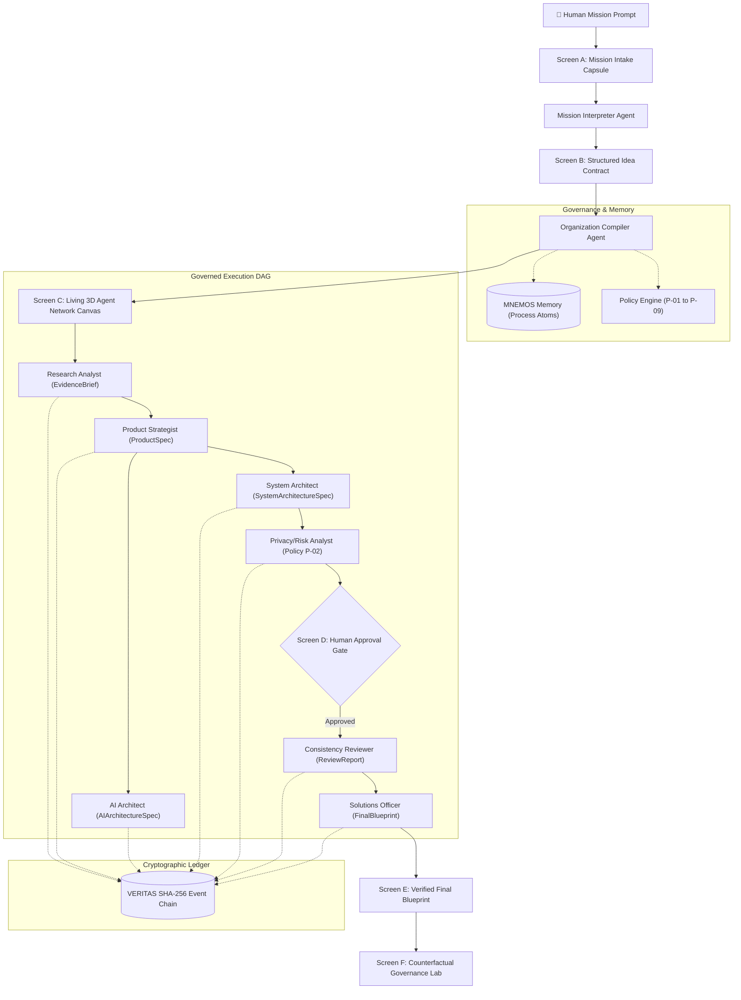

# NEXUS Organization OS

> **Governed Multi-Agent Organization Operating System**  
> *Industry-Grade · Expo-Ready · Visually Stunning · Cryptographically Verified*

---

## 🎯 The Three-Sentence Pitch
> **A user types a single raw idea.**  
> NEXUS dynamically assembles a governed team of AI specialists, assigns work by capability, enforces strict organizational policies with human approval gates, cryptographically chains every event with SHA-256 (VERITAS), and returns a verified project blueprint with replayable proof of every decision.

---

## 🏛️ System Architecture



---

## 🌟 Six Core Screens (Vertical Slice Flow)

| Screen | Route | Purpose & Key Features |
|---|---|---|
| **Screen A: Mission Intake** | `/` | Hero capsule input, seeded mission chips (EdTech, Marketplace, Campus), depth mode selector, live event ticker, token HUD. |
| **Screen B: Idea Contract** | `/projects/:id/contract` | 3-column structured contract view (Problem, Criteria, Policy Bounds, Assumptions, Open Questions, Specialist Suggestions). |
| **Screen C: Living Canvas** | `/projects/:id/canvas` | React Flow living agent graph, pulsing glow nodes, animated data packet handoffs, live SSE event feed, Node Inspector drawer. |
| **Screen D: Approval Gate** | `Modal in Canvas` | Pauses DAG on Policy P-02 (sensitive data retention) or high risk; displays policy justification and operator approval buttons. |
| **Screen E: Final Blueprint** | `/projects/:id/blueprint` | Executive summary, 4-quadrant architecture specs, verified features, VERITAS audit seal, JSON export & share. |
| **Screen F: Policy Lab** | `/lab` | Counterfactual What-If simulation matrix (P-01 to P-09), risk score gauges, and live VERITAS tamper demonstration sandbox. |

---

## ⚡ Quickstart & Local Setup

### 1. Prerequisites
- Python 3.11+
- Node.js 18+ / npm
- Docker & Docker Compose (optional for full container stack)

### 2. Backend (FastAPI API)
```bash
cd apps/api

# Create & activate virtualenv
python -m venv .venv
# Windows:
.venv\Scripts\activate
# Linux/macOS:
source .venv/bin/activate

# Install dependencies
pip install -e .

# Run dev server
uvicorn app.main:app --reload --port 8000
```
- API Docs: `http://localhost:8000/docs`
- Health Check: `http://localhost:8000/health`

### 3. Frontend (Next.js 15 Web Client)
```bash
cd apps/web

# Install dependencies
npm install

# Run dev server
npm run dev
```
- Web Application: `http://localhost:3000`

### 4. Full Docker Stack
```bash
docker compose up --build
```

---

## 🧪 Testing & Verification

### Backend Pytest Suite
```bash
cd apps/api
pytest
# Output: 11 passed (100% pass)
```

### Frontend Vitest Suite & TypeScript Typecheck
```bash
cd apps/web
npm run typecheck
npm run test
# Output: 12 passed (100% pass)
```

---

## 🛡️ Governance Policies Catalog (P-01 to P-09)

- **P-01: Evidence Grounding Rule** — All claims must cite verified primary or official literature evidence.
- **P-02: Privacy Protection & Retention Rule** — Student/personal data mandates Privacy/Risk role and human approval gate.
- **P-03: Architectural Feasibility Rule** — Frontend, backend, and DB schemas must maintain strict protocol compatibility.
- **P-04: Multi-Model Tier Routing Rule** — Model routing adheres to selected policy (`AUTO`/`STRICT`/`NOCAP`).
- **P-05: Review Convergence Rule** — Consistency Reviewer must resolve all contradictions before synthesis.
- **P-06: Tool Catalog Isolation Rule** — Strict read-only tools; denies arbitrary shell or execution tools.
- **P-07: VERITAS Event Chaining Rule** — Every state change is SHA-256 hashed and chained in atomic DB transactions.
- **P-08: Token Budget & Cost Rule** — Automatic graceful degradation against token spend overruns.
- **P-09: MNEMOS Privacy Leakage Guard** — Learned process atoms never contain verbatim human text > 12 words.

---

## 🎪 3-Minute Expo Demonstration Guide

1. **Minute 1 — Mission Intake & Dynamic Compilation**:
   - Open `http://localhost:3000`. Click the **"🎓 EdTech"** sample mission chip.
   - Click **"Start Mission"** → Observe Mission Interpreter generate the structured **Idea Contract** (Screen B).
   - Click **"Compile Organization"** → Watch compiler retrieve MNEMOS atoms and assemble 7 governed specialists.

2. **Minute 2 — Living 3D Canvas & Human Approval Gate**:
   - On the **Living Canvas** (Screen C), click **"Step"** to watch agents glow violet as tasks execute with animated data packets.
   - At Step 5 (`Privacy & Risk`), watch **Screen D Human Approval Gate** pop up under **Policy P-02**!
   - Explain that student data retention requires explicit human sign-off. Click **"Approve & Resume DAG"**.
   - Watch Consistency Reviewer and Solutions Officer synthesize the **Final Project Blueprint** (Screen E).

3. **Minute 3 — Live VERITAS Tamper Demo & Policy Lab**:
   - Navigate to **Policy Lab** (`/lab` — Screen F).
   - In Section 3, click **"Inject Corrupt Hash"** → Watch the live visual chain instantly light up RED with an alarm on Block #2.
   - Explain how SHA-256 cryptographic chaining prevents silent prompt or artifact tampering. Click **"Reset to Clean"**.
   - In Section 2, switch from **"Fully Governed"** to **"Unconstrained Autonomy"** to demonstrate real-time risk score escalation from 15% to 80%.

---

## 🔒 Cryptographic Integrity & Security Hard Rules
- **No API keys in client bundles or repository commits**.
- **Every event is SHA-256 chained in atomic DB transactions**.
- **Deterministic canonical JSON serialization (`sort_keys=True`, `separators=(',', ':')`)**.
- **Mock/Demo mode labeled `DEMO REPLAY` transparently in UI**.
